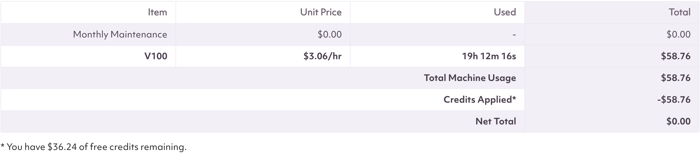
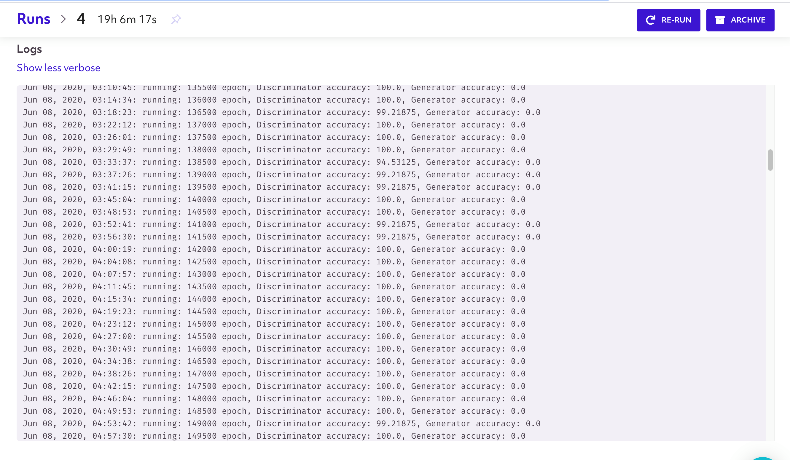
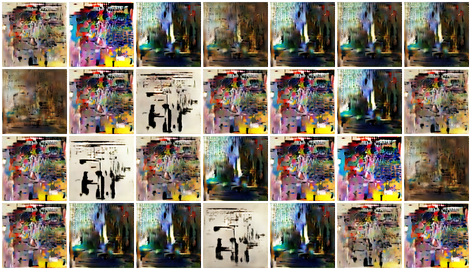
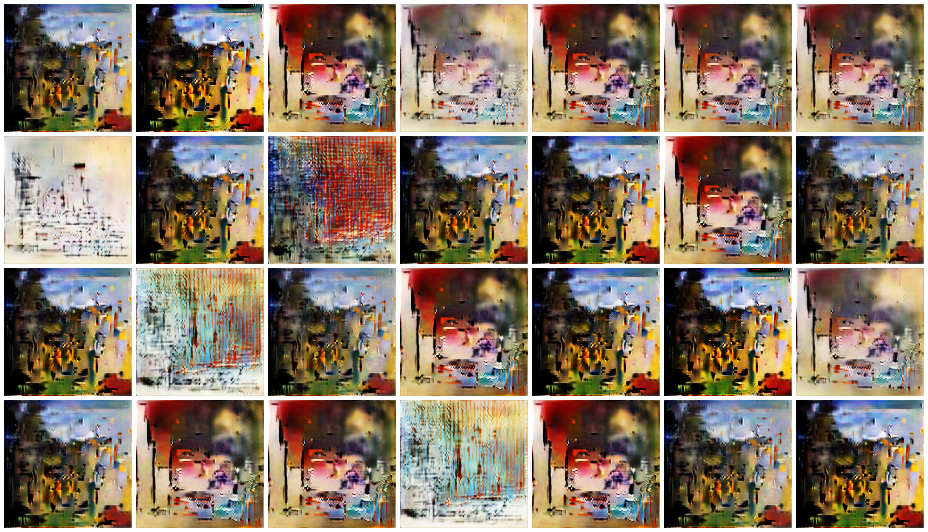
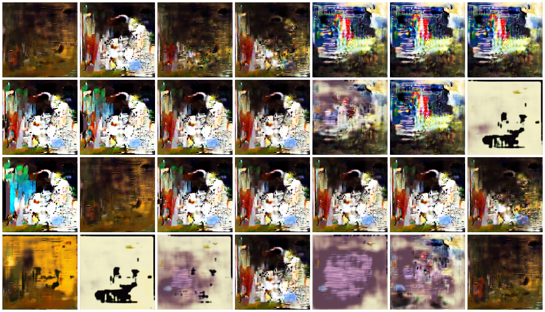
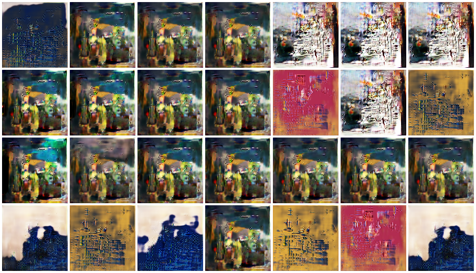
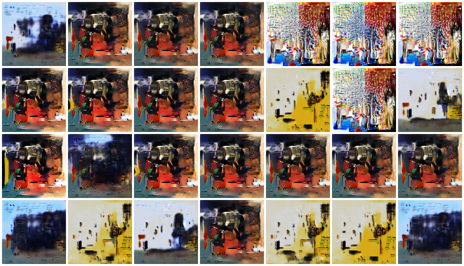
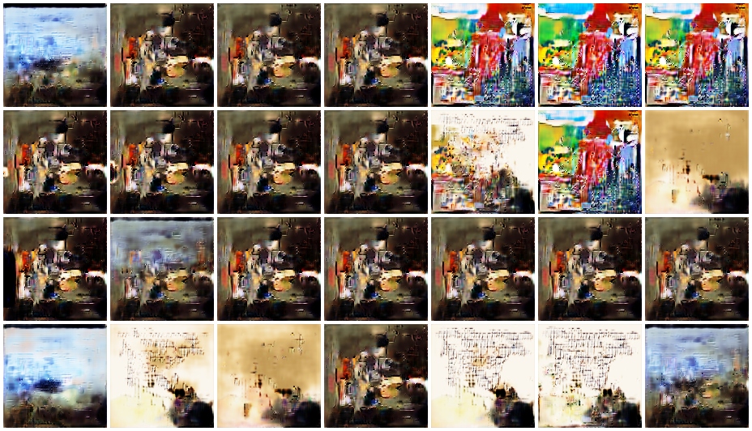

# Racial Bias in Generative Art

DSC160 Data Science and the Arts - Final Project - Generative Arts - Spring 2020

`Website` - Our complete website can be found [here](https://sites.google.com/view/racialbiasingenerativeart/home?authuser=0)

Project Team Members: 
- Kevin Elkin, kelkin@ucsd.edu
- Liam McCarthy, lamccart@ucsd.edu
- Umang Saraf, usaraf@ucsd.edu
- Charul Sharma, c4sharma@ucsd.edu
- Karan Sunil, ksunil@ucsd.edu

## Abstract

(10 points)

According to a recent study, in 18 major museums, 85% of the artists were white and 87% of artists were female. African American artists only had 1.2% of their paintings in these museums. While LatinX and Hispanic artists had just 2.8% of the paintings in the museums. Given that art is a field that has been around for thousands of years, this was quite surpring to learn about. We wanted to help reduce the gap between lesser represented communities in art. To do that we created some generative art for 10 prominent African American artists. 

We obtained paintings for different African American artists using wikiart. Next, we used these images to train a model (GAN) to create images that accurately depicts the different artwork of a given artist. We created a gallery of our results on a website for 10 different African American artists. We are hoping to capture general trends that are common to African American artists and capture multiple ideas and items within the artwork we scraped for an artist

We will be using Generative adversarial networks (GAN) to help generate the images. As of now, we are still actively conducting research to determine what other approaches we can take to accomplish this task (and examine how others have achieved a similar result). As of now, we have been reading through the implementation posted here on the CIFAR10 dataset.  https://machinelearningmastery.com/how-to-develop-a-generative-adversarial-network-for-a-cifar-10-small-object-photographs-from-scratch/

We will use wikiart to scrape images for 10 different African American artists. We aimed to get 20 images per artists. The training data will be formatted as jpegs and resized so that all images are of the same dimension. 

We hope that the final image will be a good representation of the different artists. This will almost be like a summary image to represent the artist. This will take the complexity of multiple different images and simplify it down to one image for the user to view. 

Website - we will have a gallery of different African American artists and the respective generative images. 

The first challenge that we faced was attempting to scrape artwork of African American artists. There were far fewer paintings on wikiart of African American artists than White artists. 

Additionally, another challenge will be the implementing a GAN model that will create new images off the original image data. These original images may be different sizes and resolution so there may be some preprocessing before inputting the images into the model. 

We will be using the idea of GANs covered in class. We will create a generator from latent vectors (code) to visual outputs. 
This is culturally important because African American artists are currently underrepresented in the generative art field and we would like to help change this. 

- https://www.shvembldr.com/ - An interactive generative art piece created using computer algorithms and random seed as well as user input.
- https://www.artbreeder.com/ - A GAN that breeds two images to create novel new ones using GANBreeder.
- https://runwayml.com/ - An easy, code-free tool that makes it simple to experiment with machine learning models in creative ways.

## Data and Model

(10 points) 

### Data Ingestion
For our project we decided to use [WikiArt](https://www.wikiart.org/) to get paintings of artists. We scraped paintings for 10 prominent African American artists. We wanted to note that even within WikiArt there was an inherent bias when we were trying to select the works of these artists. Many of their paintings were not in the encyclopedia and also there were many artists that we wanted to include like Kara Walker and Faith Ringgold who did not have any work on WikiArt. This is one of the inherent basis that we were faced with when building our dataset; we were constrained to the artwork represented in WikiArt with it being increasingly difficult to find various African American artists. However, we still were able to compile 538 works of art for us to train a GAN on in order to create our generative art. In order to collect this data, we scraped the WikiArt website and stored all the paintings as either jpeg or png files in a directory for each artist so they could be sampled by artist later. We explored some of the most influential African American artists throughout history. Below are the ten artists that we chose (base on popularity, influence, and contribution) to create our dataset from. 

1. Jacob Lawrence
2. Aaron Doughlas
3. Clementine Hunter
4. Jean-Michel Basquiat
5. Kerry James Marshall
6. Romare Bearden
7. Alma Woodsey Thomas
8. David Hammons
9. Henry-Ossawa-Tanner
10. William-H-Johnson

More in depth descriptions of these artists can be found on our website [here](https://sites.google.com/view/racialbiasingenerativeart/home?authuser=0)

### Data Preprocessing

We used some of the techniques we learned in Exercise 1 to scrape and save all the images for each of the 10 artists we selected. We had a total of 538 pieces of artwork to train our model on; However, prior to training our model we had to ensure that all the images were the same size for when we fed them into our neural network. 

In order to feed the information into a GAN, we needed to first get the various images into the appropriate format and sizing and create our training datasets. Because the images were saved in various image formats, we needed to make sure the images were processed to be the same format. This meant that when we converted the images into a matrix of numbers representing each pixel in the image, we had to convert them into the 'RGB' image format. This means there are 3 matrices, each with a pixel value for the 3 channels of color (Red, Green and Blue). Additionally, we also had to resize the images to be 128x128 pixels. This helps in making the GAN run faster because the image sizes are smaller and also makes sure they are all the same uniform pixel count. These image matrices are then all added to a list and then saved to disk so that the training data can be fed into the GAN.

### Model Creation

To train our model on our dataset we made use of a platform known as Spell. Spell is a MLOps platform that is optimized for machine learning and deep learning. The servers and hardware are hosted by AWS which makes running our models both scalable and easy. Additionally, we wanted to use a service that would allow us have more variety for hardware specifications and was reliable. Our final model consisted of 150,000 epochs on a batch size of 64 across our entire dataset of 538 images; we ran our final model on a single V100 machine taking a little over 19 hours to complete. Below are 2 screenshots showing our epochs and machine usage. 

This service allowed us to upload our training data as well as pairing it with Github to run various models with different parameters on their allocated servers. Meaning, we were able to run several different models and get hundreds of results in hours as opposed to the days it would've taken without it. While the model was training, at certain epochs an image would be saved with a grid of results that were generated during that epoch. These are the images that can be found in the Art Gallery section of the [website](https://sites.google.com/view/racialbiasingenerativeart/art-gallery?authuser=0). 

The link to the spell platform we used for this project can be found [here](https://spell.run/?campaignid=2042784704&adgroupid=72961561115&adid=382130409573&gclid=EAIaIQobChMIu8zHmpn76QIV4iCtBh1jdQ2GEAAYASAAEgI1ZfD_BwE)

*Note: Our group was able to obtain $95 of free credit on one of our accounts by referring the other members and having them sign up ($15 per referral for both parties). Additionally, we used a one time promo code to obtain $10 credit. This could be a potential alternative for next quarter for students who continue to have issues with the DSMLP servers. 
A full gallery of some of the generative art we created can be found in the gallery section of our website [here](https://sites.google.com/view/racialbiasingenerativeart/art-gallery?authuser=0)

We have included 2 forms of training data in our repository. Unfortunately, the full dataset was too large to include in our repository so we have included two smaller forms that we have used for the initial models instead. 

### Training Data

[same_num_dataset.zip](data/same_num_dataset.zip) - This dataset included a total of 100 pieces of artwork from WikiArt; we decided to randomly sample 10 pieces of artwork from each artist 

[small_dataset.zip](data/small_dataset.zip) - This dataset included a total of 186 pieces of artwork from WikiArt; we decided to randomly sample 20 pieces of artwork from each artist. It is important to note that some artists did not have 20 images or more so we would just obtain all the images they had in this case. 

### References

Our group used similar ideas and generation techniques found in the article [here](https://towardsdatascience.com/generating-modern-arts-using-generative-adversarial-network-gan-on-spell-39f67f83c7b4). The code that we followed is also included in this link as well. 

## Code

(20 points)

Data Collection/Preprocessing - [scrape_art.ipynb](https://github.com/ucsd-dsc-arts/dsc160-final-dsc160_final_group07/blob/master/code/scrape_art.ipynb)

This notebook contains all the functions and code in order to scrape the paintings from WikiArt, format them into the correct matrices and then create the training data sets. The paintings are scraped from the WikiArt website by querying a URL via BeautifulSoup to attain an XML with the URLs for all the paintings of a certain artist. These URLs are then requested and the images at the web address are downloaded and stored in a directory “data” with subdirectories for each artist. These image files are then processed so they can be fed into the GAN. This requires all of the images being converted to the same format of having 3 matrices each with pixel values corresponding to the three Red, Green, and Blue channels. Additionally, we resize the images so they are uniformly 128x128 pixels. This ensures the model is able to take in all the images and process them without issue. Lastly, the training set is created by compiling all the resized and correctly formatted images. Optionally, the images can be sampled depending on the SAMPLE_SIZE or if it is large then it will sample all 538 images across the 10 artists.

Model Creation/Training - [art_gan.py](https://github.com/ucsd-dsc-arts/dsc160-final-dsc160_final_group07/blob/master/code/art_gan.py)

This python file contains all of the code necessary to create the discriminator and generator for the GAN as well as the training on the model on the dataset of images. The code also saves the results of certain epochs throughout the training. There are many parameters that can be set including how many preview images it will show in the saved images, the number of epochs, the batch size, the frequency of the saving of images, the dataset to train on, and a few others. The first step is building the discriminator which as stated earlier involves multiple 2D convolution layers coupled with a LeakyReLu layer as the activation function. The generator is then constructed which utilizes a similar procedure but with the variation of a 'tanh' activation function for the fully connected layer of the model. Lastly the image is then saved to an “output” folder so that the images can be viewed through the training process. For additional information, the procedure and code is based off [this](https://towardsdatascience.com/generating-modern-arts-using-generative-adversarial-network-gan-on-spell-39f67f83c7b4) Towards Data Science article.

## Results

(30 points)

[Website Gallery](https://sites.google.com/view/racialbiasingenerativeart/art-gallery?authuser=0)
For our results we will be discussing and analysing a few of the images of the later epochs in both our small dataset (50,000 epochs, batch size 32, small_dataset.zip) and our complete dataset (150,000 epochs, batch size 64, 538 images)

### Small Dataset

We will first discuss two of the generative art samples that we obtained in the later samples of our small dataset. Both of these epochs fall within the range of 35,000 - 50,000 epochs. 

In this first image we can see images that include a variety of vibrant colors. When juxtaposing the generative artwork in just the African American dataset this was perhaps the most stark difference. The use of bright colors that "pop" in the images truly set the images appart from traditional generative art examples we found online that included more European artworks. Additionally, we can see another type of image on a white/tan background with what appears to be figures of people standing still. The person on the left appears to be knelling with his arms extended outward and the person on the right appears to be examining something in the arms of the other person. In many of the artworks that we trained on, images of humans typically appeared in a similar style; these training images sometimes depicted figures with simple designs that appeared to be the focal point of the image. Moreover, the sharp contrast in bright colors would direct the viewers eye to these figures first. 

In this second epoch we can see elements of an outside meadow (image in the upper left corner). The image depicts what appears to be a blue sky with a green grassy ground next to a brown cannon. This image to us resembled something that was more scenic and calm like some of the images we viewed in our training set. Additionally, the image in the 3rd column, 2nd row resembles a woven pattern similar to a quilt. This particular image appears to draw inspiration from some of Alma Woodsey Thomas’s artwork. Her artwork is very unique and uses a grid like structure with bright colors to paint various patterns and senes from nature. 

### Large Dataset

We will now look at 4 of the examples we obtained from scalling up our model and running our full dataset onn 150,000 ephocs on a batch size of 64. These images come from the later ephocs rangin from 120,000 - 150,000 epochs. 

We found this epoch to be particularly interesting due to the image produced in the 2nd column, 4th row. This image depicts what appears to be a face with two eyes, and ear, and hair around the head (bald on the top). Some of our group members interpreted this face looking over a city like structure while others believed that the part underneath the face was to be the mans shoulders. Additionally, the image in the 5th column and 1st row showed of some of the many bright colors we mentioned earlier. in addition to this, we began noticing a pattern of seeing solid color figures appear on a white/tan background with little noise. This was another difference that we began to notice in comparison to other forms of generative artwork trained on more European or "unbias" datasets. We often see figures appear in backgrounds that have more noise involved (such as trees, nature, etc.) in European generative art models - here we see very little of that. 

This section should summarize your results and will embed links to documentation to significant outputs. This should document both process and show artistic results. This can include figures, sound files, videos, bitmaps, as appropriate to your generative art idea. Each result should include a brief textual description, and all should be listed below: 

- image files (`.jpg`, `.png` or whatever else is appropriate)
- audio files (`.wav`, `.mp3`)
- written text as `.pdf`

## Discussion

(30 points, three to five paragraphs)

While our results varied greatly, certain styles were clearly visible, such as Jacob Lawrence's cubism. Throughout, there were many bright colors in the generated art, with red, green, and yellow themes running throughout. As compared to analyses done of western art, such as in http://quasimondo.com/, there were far brighter colors, as well as fewer distiguishable figures/outlines.

Our results relate to the current movement for black voices to be heard, and to the movement raising awareness for their suppression. Through these results, it is clear to see that more traditionally western generative art projects are VERY different than the results we produced, facilitating the realization that African artists and their styles have gone unseen in the generative art world.

In the future we would like to include more African American artists' paintings to create generative art and more paintings per artist. Further, we would like to represent other less represented communities in the generative arts field as well like Hispanic and LatinX artist. Further, it would be interesting to include different forms of art like sculptures and other digital art, rather than just oil paintings from wikiart. This would make our dataset more diverse and allow us to generate better images. 

Further, we would like to analyze trends we see in the generative art of African American artists and see if similar trends exist in White artists. It would be interesting to analyze whether white artists have similar trends in their artwork, but are better represented in museums etc.

## Team Roles

- Umang Saraf - Created the website 
- Kevin Elkin - Worked with Liam to scrape,create, and run our model on 50,000 and 150,000 ephocs using spell. Wrote the results section and part of the data and model section
- Karan Sunil - Wrote/Revised abstract, wrote part of data ingestion code. 

## Technical Notes and Dependencies

Any implementation details or notes we need to repeat your work. 
- Additional libraries you are using for this project
- Does this code require other pip packages, software, etc?
- Does this code need to run on some other (non-datahub) platform? (CoLab, etc.)

## Reference

All references to papers, techniques, previous work, repositories you used should be collected at the bottom:
- Papers
- Repositories
- Blog posts
https://hyperallergic.com/501999/artists-in-18-major-us-museums-are-85-white-and-87-male-study-says/
